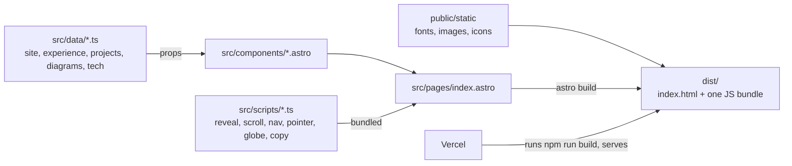

# Justin Kong - portfolio

Source for [justinkong.app](https://justinkong.app), my personal site.

## What it does

A single static page covering who I am, where I've worked, and what I've built, with a focus on backend and distributed systems work.
The content lives in typed data files, so adding a role or a project is a data edit, not a markup edit.

Project cards for the infrastructure work (Belady, Conduit, Pulsegrid) show architecture diagrams drawn as SVG from node and edge data, so they stay sharp at any size.
Hovering a card lights the nodes in pipeline order.
The hero globe is a small canvas renderer, and the rest of the motion is CSS plus a few IntersectionObserver and requestAnimationFrame scripts, about 8 KB of JavaScript in total.
Every piece of content renders without JavaScript, and motion is turned off under `prefers-reduced-motion`.

## Tech stack

- [Astro](https://astro.build) 7, static output, no UI framework
- TypeScript (strict), checked with `@astrojs/check`
- Plain CSS: design tokens plus scoped component styles
- Canvas 2D for the hero globe, inline SVG for diagrams and icons
- Self-hosted fonts: Space Grotesk, IBM Plex Sans, IBM Plex Mono
- Deployed on Vercel

## Architecture



At build time `projects.ts` feeds each entry into `ProjectCard.astro`, which renders `Diagram.astro` from the project's node and edge list, or a lazy-loaded screenshot when there is no diagram.
Astro writes that out as plain HTML with the CSS inlined, and the scripts in `src/scripts` ship as a single module that only adds behavior on top.

## What building this taught me

The first version was a Django app, and its only backend feature was a contact form.
The endpoint returned 503 on every submit because the SMTP env vars it needed were never set in any environment, so the server was running for nothing.
I removed Django entirely and replaced the form with a mailto link and a copy button that can't fail silently.

For a while the Open Graph tags pointed at justinkong.dev, a domain that doesn't serve the site, so every shared link previewed a dead URL.
Pointing `og:url` and `og:image` at justinkong.app and adding a canonical link fixed it, and it's why the image paths under `/static` haven't moved.

The page used to ship 12.2 MB of assets, mostly unoptimized images and CDN fonts.
Re-encoding to WebP and self-hosting subset fonts brought it to 423 KB.

## Quick start

Requires Node 22.12 or newer.

```sh
npm install
npm run dev      # local dev server at http://localhost:4321
npm run build    # type check, then build to dist/
npm run preview  # serve the built site
```
